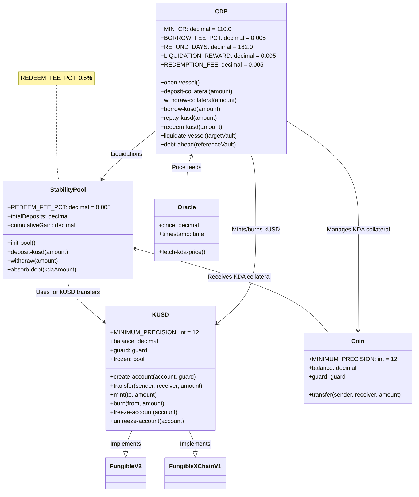
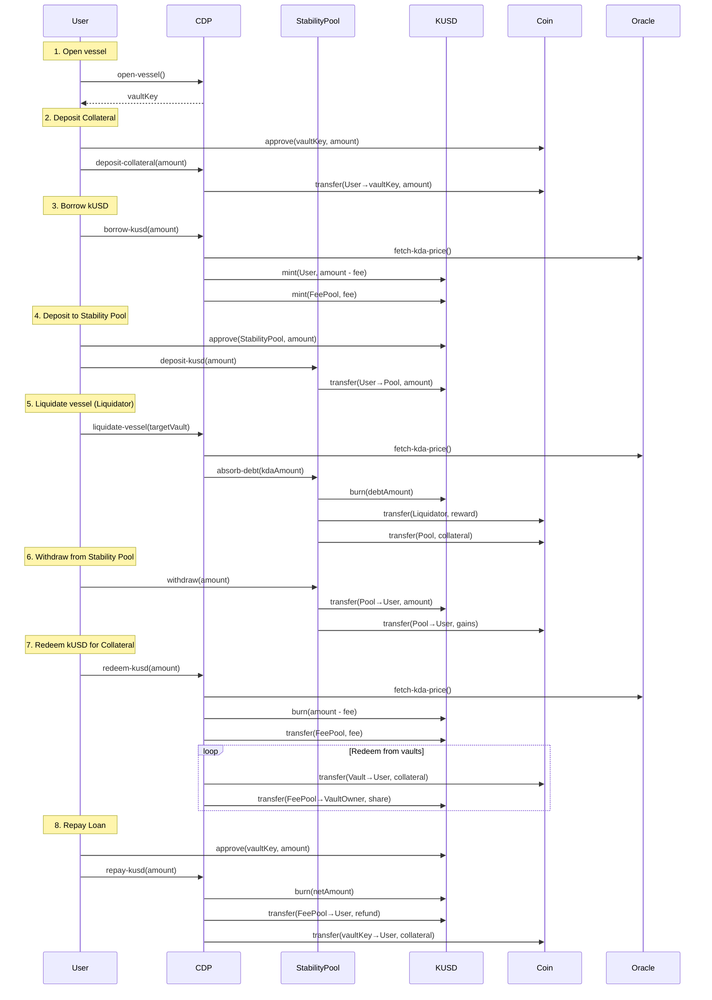
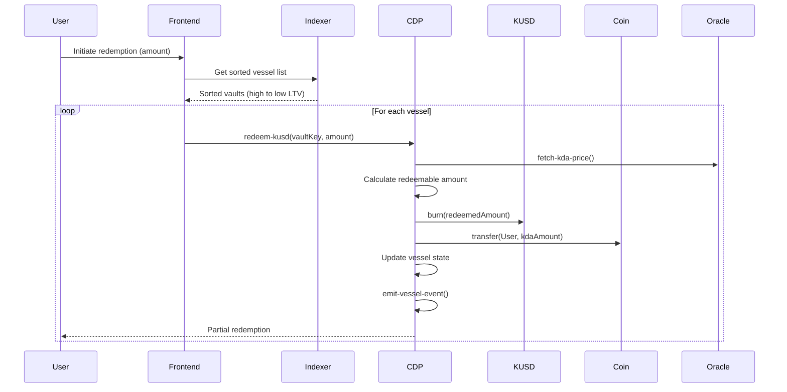
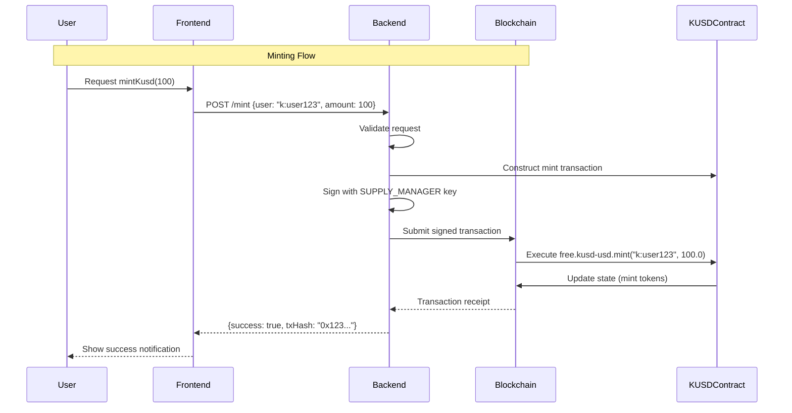
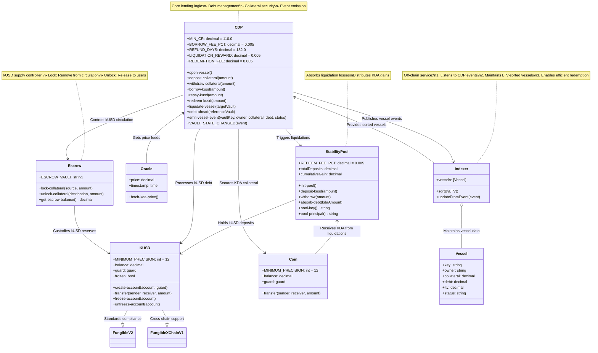
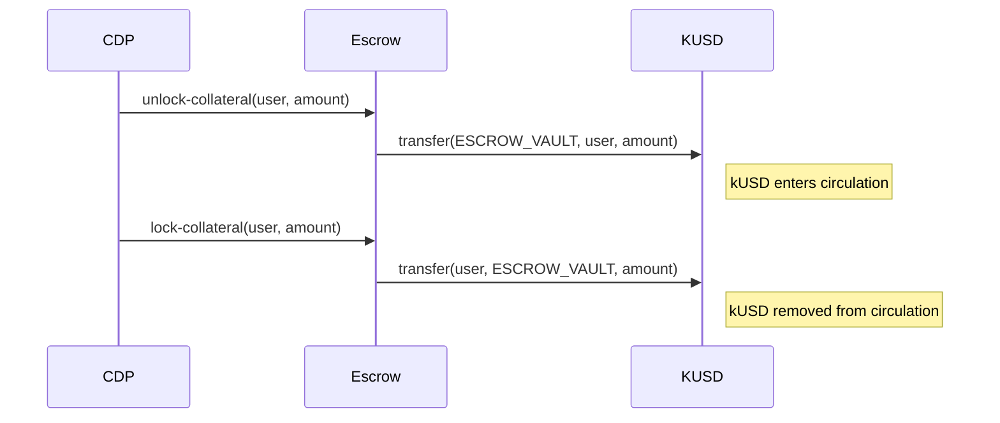

# Kudos Protocol
Kudos Protocol is a permissionless (well it still has governance for now :P), fully on-chain lending platform on Kadena that lets users lock up KDA as collateral to mint the dollar-pegged stablecoin kUSD, repay loans with time-based fee refunds, and optionally earn KDA yield via a Stability Pool.


## Concepts:
**CDP**
The CDP module lets users lock KDA collateral in individual “vessels” and borrow kUSD up to a maximum Loan-to-Value ratio, enforcing collateralization via the borrow-kusd and deposit-collateral functions. If a vault’s collateral ratio falls below the protocol minimum, anyone can call liquidate-vault, which uses the Stability Pool’s kUSD to pay off debt and seizes collateral for redistribution.

**STABILITY POOL**
The Stability Pool holds users’ kUSD deposits and automatically absorbs the debt of undercollateralized CDP vaults during liquidations, exchanging pooled kUSD for KDA collateral. Depositors earn KDA yield proportional to their share of the pool each time a liquidation occurs, aligning incentives to keep the system solvent.

# Files:
- kusd.pact (kUSD Stablecoin) borrowed from brale
- cdp.pact (Collateralized Debt Positions)
- stability-pool.pact` (Stability Pool)

--


## Meet Emily

Emily is a Kadena user who wants to borrow kUSD against her KDA.

### 1. Open a vessel

```pact
(free.cdp.open-vessel)
```

> **Success** ⇒ returns `"vessel-k:Emily"`.

**Edge**

- Calling again ⇒ `Error: "vessel already exists"`.

---

### 2. Deposit Collateral

```pact
(free.cdp.deposit-collateral 100.0)
```

> **Success** ⇒ vessel status becomes `"Active"`.

**Edges**

- Zero/negative ⇒ `Error: "Deposit amount must be > 0"`
- On closed vessel ⇒ `Error: "Vessel is closed"`

---

### 3. Borrow kUSD

```pact
(free.cdp.borrow-kusd 50.0)
```

> **Success**
>
> - Emily mints 50 kUSD to herself
> - 0.25 kUSD fee → fee-pool
> - vessel debt = 50.25 kUSD

**Edge**

- Too much ⇒ `Error: "Collateral ratio too low"`

---

### 4. (Optional) Check Your Spot in the Redemption Queue

Before burning any kUSD, Emily can see how much debt sits ahead of her vessel (higher-LTV) with:

```pact
(free.cdp.debt-ahead "vessel-k:Emily")
```

> **Success** ⇒ e.g. `1200.0` (kUSD ahead to clear before hers).

**Edges**

- Invalid vessel key ⇒ `Error: "No value found in table free.cdp.vessels for key: vessel-k:Emily"`

---

## 5. Two Redemption Paths

### A) **Direct** (`redeem-kusd`)

1. Call

   ```pact
   (free.cdp.redeem-kusd 10.0)
   ```

2. Burns 9.95 kUSD net, fee → fee-pool, scans **all** vaults by LTV, repays debt and returns KDA.

**Edges**

- < 1 kUSD ⇒ `Error: "Redemption amount must be >= 1 kUSD"`
- Not enough collateral ⇒ `Error: "Not enough collateral to redeem"`
- Gas-heavy at scale

---

### B) **Via the Stability Pool**

#### B.1 Deposit into Pool

```pact
(free.stability-pool.deposit-kusd 20.0)
```

> Locks 20 kUSD into the pool.

**Edges**

- ≤ 0 ⇒ `Error: "Deposit amount must be > 0"`

---

#### B.2 Someone Else’s vessel Is Liquidated

Protocol calls:

```pact
(free.stability-pool.absorb-debt <KDA-paid>)
```

> Pool’s `cumulativeGain` bumps so Emily accrues KDA yield.

---

#### B.3 **Own vessel Gets Liquidated While in Pool**

1. Emily deposits **all** 50 kUSD:

   ```pact
   (free.stability-pool.deposit-kusd 50.0)
   ```

2. Her vessel CR < 110% ⇒

   ```pact
   (free.cdp.liquidate-vessel "vessel-k:Emily")
   ```

3. Under the hood:

   - Burns 50 kUSD from the pool (covers her debt)
   - Pays liquidator \~0.5 KDA
   - Sends \~99.5 KDA into pool via `(free.stability-pool.absorb-debt 99.5)`
   - Bumps `cumulativeGain` so **all** depositors (just Emily) earn 99.5 KDA

4. **Outcome**

   - Her 50 kUSD is spent
   - She now holds \~99.5 KDA as pool yield

---

#### B.4 Withdraw Your KDA + Yield

```pact
(free.stability-pool.withdraw 50.0)
```

> Emily receives \~99.5 KDA.

**Edges**

- ≤ 0 ⇒ `Error: "Withdraw amount must be > 0"`
- > deposit ⇒ `Error: "Exceeds deposit"`

---

#### B.5 (Optional) Finish Direct Redeem

If she still held kUSD, she could:

```pact
(free.cdp.redeem-kusd remainingAmount)
```

---

### 6. Repay & Close vessel

#### 6.1 Repay

```pact
(free.cdp.repay-kusd 50.25)
```

> Burns net kUSD, refunds time-based fee; debt → 0, status → `"Inactive"`.

**Edges**

- Inactive vessel ⇒ `Error: "Vessel must be Active"`

#### 6.2 Withdraw Collateral

```pact
(free.cdp.withdraw-collateral 100.0)
```

> Returns her 100 KDA, vessel removed.

**Edges**

- ≤ 0 ⇒ `Error: "Withdraw amount must be > 0"`
- Ratio too low (debt remains) ⇒ `Error: "Collateral ratio too low"`

---

## 7. Liquidation Fallback

If Emily hadn’t used the pool and fell under-collateralized:

```pact
(free.cdp.liquidate-vessel "vessel-k:Emily")
```

> Burns pool kUSD, pays liquidator, traps collateral in pool.

**Edges**

- CR too healthy ⇒ `Error: "Not eligible for liquidation"`
- Pool empty ⇒ `Error: "Insufficient pool kUSD"`

A Classdiagram showcasing the protocol



---

System flow chart:
This flows cover the complete lifecycle from vessel creation to liquidation, including both CDP operations and Stability Pool interactions, with all fee mechanics and collateral movements represented.



Key User Flows Explained:

1. **vessel Creation**:

   - User opens a new collateral vessel
   - Receives unique vessel key

2. **Collateral Deposit**:

   - User approves and transfers KDA to vessel
   - Collateral amount recorded in CDP

3. **kUSD Borrowing**:

   - CDP checks collateral ratio using oracle price
   - Mints new kUSD (minus 0.5% fee)
   - Fee sent to protocol fee pool

4. **Stability Pool Deposit**:

   - User deposits kUSD into Stability Pool
   - Pool records user's share and current gain snapshot

5. **vessel Liquidation**:

   - Liquidator triggers liquidation of undercollateralized vessel
   - Stability Pool absorbs debt by burning kUSD
   - Liquidator receives 0.5% KDA reward
   - Remaining collateral goes to Stability Pool

6. **Stability Pool Withdrawal**:

   - User withdraws kUSD principal + proportional KDA gains
   - Pool updates cumulative gain tracking

7. **kUSD Redemption**:

   - User redeems kUSD for discounted collateral
   - System finds highest-LTV vaults to redeem against
   - vessel owners receive 70% of redemption fees

8. **Loan Repayment**:
   - User repays kUSD to reduce debt
   - May receive prorated fee refund (up to 182 days)
   - Withdraws collateral after full repayment

--- 
**Issues**: 

Within thic poc's cdp currently in order to redeem-kusd we have to iterate over all vessels in order to get the LTV, and sort them by their LTV ratio,
this will exhaust gas. So it would probably be best to offload this process to a indexer.

```lsp
; When a kUSD holder calls redeem-kusd, the contract:
;  1. Enforces the caller’s REDEEM_KUSD capability and minimum redeem amount.
;  2. Computes and collects the redemption fee into the fee-pool, then burns the remaining kUSD.
;  3. Verifies the fee-pool can cover 70% vessel payouts, then gathers all vaults sorted by highest LTV.
;  4. Iteratively pays off each vault’s debt up to the holder’s net kUSD, transfers the matching KDA back to the redeemer,
;     updates each vault’s collateral, debt, and status.
;  5. Distributes 70% of each vault’s share of the fee to that vessel owner (leaving 30% in the pool)
;     and ensures the entire kUSD amount was redeemed or reverts.

  (defun redeem-kusd:string (redeemAmount:decimal)
  @doc "Deduct fee, burn net kUSD, distribute fee, redeem KDA"
  (let ((callerAccount (read-msg 'sender)))
    (with-capability (REDEEM_KUSD callerAccount redeemAmount)
      (enforce (>= redeemAmount 1.0) "Redemption amount must be >= 1 kUSD")

      (let* (
             ; Fetch current KDA price for valuation -spec: use oracle price
             (currentKdaPrice             (fetch-kda-price))
             ; Lookup redemption fee pct (e.g. 0.5%) - spec: fixed redemption fee
             (configuredRedemptionFeePct  (get-config "REDEEM_FEE" DEFAULT_REDEMPTION_FEE_PERCENTAGE))
             ; Compute total fee to collect -  spec: fee = redeemAmount * feePct
             (totalFeeCollected           (* redeemAmount configuredRedemptionFeePct))
             ; Net kUSD to burn after fee - spec: netRedeemable = redeemAmount - fee
             (netRedeemableAmount         (- redeemAmount totalFeeCollected))
             ; vessel-share of fee (70% of totalFeeCollected) - spec: 70% of fee to vaults
             (vaultsFeeShareTotal         (* totalFeeCollected 0.7)))

        (free.kusd-usd.burn callerAccount netRedeemableAmount)

        ; Transfer full fee into fee-pool account - collect full redemption fee
        ; first add the 100% to the fee later, 70% will be distributed to vaults
        (free.kusd-usd.transfer callerAccount (fee-pool-account) totalFeeCollected)

        ; Ensure fee-pool has enough to cover vessel shares - spec: enforce sufficient fee reserve
        (let ((feePoolBalance (free.kusd-usd.get-balance (fee-pool-account))))
          (enforce (>= feePoolBalance vaultsFeeShareTotal) "Insufficient fee reserve"))

        ; Gather all vessel entries with computed LTV - spec: sort vessels by descending LTV
        ; this will take up way to much gas, any other way to do this?

        ; we get all vessels, and sort them by their LTV ratio
        (let* ((allVesselEntries
                 (map (lambda (vaultOwnerKey:string)
                        (with-read vessels vaultOwnerKey
                          { "collateralAmount" := vesselCollateral
                          , "debtAmount"       := vesselDebt
                          , "status"           := vesselStatus }
                          ;; compute each vault’s loan-to-value ratio
                          (let ((loanToValueRatio
                                 (if (or (= vesselCollateral 0.0) (= vesselDebt 0.0))
                                     0.0
                                     (* 100.0 (/ vesselDebt (* vesselCollateral currentKdaPrice))))))
                            { "vaultOwner":       vaultOwnerKey
                            , "collateralAmount": vesselCollateral
                            , "debtAmount":       vesselDebt
                            , "status":           vesselStatus
                            , "loanToValueRatio": loanToValueRatio })))
                      (keys vessels)))
               (sortedVesselEntries
                 (sort allVesselEntries
                       (lambda (firstEntry secondEntry)
                         (> (at 'loanToValueRatio firstEntry)
                            (at 'loanToValueRatio secondEntry)))))

               (initialAccumulatorMap
                 { "remainingRedeem":    netRedeemableAmount ; how much kUSD we still have to spend
                 , "totalKdaRedeemed":  0.0 }) ; how much KDA we redeemed so far starting at 0

               ;;Fold over sorted vaults, redeeming up to your kUSD
               (finalAccumulatorMap
                 (fold (lambda (accumulatorMap currentVesselEntry)
                         (let* ((remainingRedeemAmount (at 'remainingRedeem accumulatorMap))
                                (entryCollateral        (at 'collateralAmount   currentVesselEntry))
                                (entryDebt              (at 'debtAmount         currentVesselEntry))
                                (entryAvailableValue    (* entryCollateral currentKdaPrice))
                                ;; max kUSD value applied to this vault’s debt
                                (redeemValueForThisVault (min remainingRedeemAmount entryDebt entryAvailableValue))
                                ;; KDA to return to the user
                                (kdaToReturnToUser      (min entryCollateral (/ redeemValueForThisVault currentKdaPrice)))
                                ;; vault’s share of the fee
                                (vaultFeeShare          (* vaultsFeeShareTotal (/ redeemValueForThisVault redeemAmount)))
                                (updatedDebtRemaining   (max 0.0 (- entryDebt redeemValueForThisVault)))
                                 (updatedVesselStatus (cond
                                    ((= updatedDebtRemaining 0.0) "Redeemed")
                                    ((< updatedDebtRemaining entryDebt) "PartiallyRedeemed")
                                    (at "status" currentVesselEntry))))

                           ; never redeem more debt or collateral than available
                           (enforce (<= redeemValueForThisVault entryDebt) "Cannot redeem more than debt")
                           (enforce (<= kdaToReturnToUser entryCollateral) "Collateral overdraw")

                           (update vessels (at 'vaultOwner currentVesselEntry)
                             { "collateralAmount": (- entryCollateral kdaToReturnToUser)
                             , "debtAmount":       updatedDebtRemaining
                             , "status":           updatedVesselStatus })

                           ; Distribute vault’s fee share - spec: pay vaults 70% of fees
                           (free.kusd-usd.transfer (fee-pool-account)
                                                   (at 'vaultOwner currentVesselEntry)
                                                   vaultFeeShare)

                           ;Accumulate remaining and redeemed totals
                           { "remainingRedeem":   (- remainingRedeemAmount redeemValueForThisVault)
                           , "totalKdaRedeemed": (+ (at 'totalKdaRedeemed accumulatorMap) kdaToReturnToUser) }))
                       initialAccumulatorMap
                       sortedVesselEntries)))

          ; Ensure we used up all your kUSD - spec: enforce full redemption or fail
          (enforce (<= (at 'remainingRedeem finalAccumulatorMap) 0.0) "Not enough collateral to redeem")

          "RedeemCompleted")))))
```

We would have something like this (pseudo)


In our pact we would do something like this:

```lsp
(defcap VAULT_STATE_CHANGED
  (vaultKey:string
   owner:string
   collateral:decimal
   debt:decimal
   status:string
  )
  @event
  true
)

; helper
(defun emit-vessel-event (vaultKey owner collateral debt status)
  (emit-event (VAULT_STATE_CHANGED vaultKey owner collateral debt status))
```

and in our primary functions we would do something like:

```lsp
(defun deposit-collateral:string (depositAmount:decimal)
  ... etc
  (update vessels callerAccount { "collateralAmount": newCollateralAmount })
  (emit-vessel-event vaultKey callerAccount newCollateralAmount currentDebtAmount currentVesselStatus)
  "DepositCompleted")
```

Our flow would become:



This way the cdp would handle single vaults instead of going over all vaults

```lsp
(defun redeem-kusd (vaultKey:string redeemAmount:decimal)
  @doc "Redeem specific amount from a single vessel"
  (let* (
         ; Fetch the up-to-date KDA/USD price from the oracle
         (currentPrice (fetch-kda-price))

         ; Load the vault record by its key
         (vessel (read vessels vaultKey))

         ;Compute the maximum kUSD you can redeem from this vault:
         ; You cannot exceed the vault’s outstanding debt
         ; You cannot extract more value than its collateral is worth
         (maxRedeemable
           (min
             ; outstanding debt in kUSD
             (at 'debtAmount vessel)
             ; collateral value in kUSD = collateralAmount * price
             (* (at 'collateralAmount vessel) currentPrice)))

         ;Determine how much to actually redeem:
         ; the lesser of what the user asked and the vault’s maxRedeemable
         (amountToRedeem (min redeemAmount maxRedeemable))

         ; Convert that kUSD amount into KDA to send back
         (kdaToSend (/ amountToRedeem currentPrice)))

    (enforce (> amountToRedeem 0)
             "Nothing to redeem from this vessel")

    ;Update the vault’s on-chain state:
    ; - Subtract the redeemed KDA from its collateral
    ; - Subtract the redeemed kUSD from its debt
    (update vessels vaultKey {
      "collateralAmount": (- (at 'collateralAmount vessel) kdaToSend)
      , "debtAmount":       (- (at 'debtAmount vessel) amountToRedeem)
    })

    ;Burn the kUSD from the vault’s kUSD balance
    (free.kusd-usd.burn (this wont work) <-- see code we need the pact gods
      (get-vessel-principal vaultKey)
      amountToRedeem)

    ;Transfer the corresponding KDA back to the user
    (coin.transfer
      (get-vessel-principal vaultKey)
      (read-msg 'sender)
      kdaToSend)

    ; Improrant: We emit the event so off-chain indexers/frontends see the new vault state
    (emit-vessel-event
      vaultKey
      (at 'owner vessel)
      ; new collateral left
      (- (at 'collateralAmount vessel) kdaToSend)
      ; new debt left
      (- (at 'debtAmount vessel) amountToRedeem)
      ; status = "Redeemed" if fully cleared, else remain "Active"
      (if (= (- (at 'debtAmount vessel) amountToRedeem) 0.0)
          "Redeemed" "Active"))

    (format "Redeemed {} kUSD from vessel {}"
            [amountToRedeem vaultKey])
))

```

## Doing this we gain:

- Less gas consumption
- Off-Chain Sorting
- and simpeler code!

---
(read my comments in cdp.pact about minting / burning,  pact gods needed) -> maybe we shouldnt mint at all and just do transfer from a escrow

It could be a idea idea to offload the actual kUSD minting / burning calls to a trusted backend service, that does the mint/burn calls
(Oversimplified chart)



## The primary task of this service would be:

- Hold the SUPPLY_MANAGER keyset (to sign transaction)
- Expose its own authenticated GraphQL/REST endpoint
- Validate user requests
- Call .mint / .burn on-chain

But this can propbably be done without a backend (burn/mint) since this comes with a extra security risk that is probably handled better with pact and keeping it on chain
#orNotMintAndBurn 

### After speaking with andy, for safety, a escrow would be more safe ( with hacks atleast you dont have access to mint or / and only the fund in escrow can be drained)
It would look something like this:


flow:

