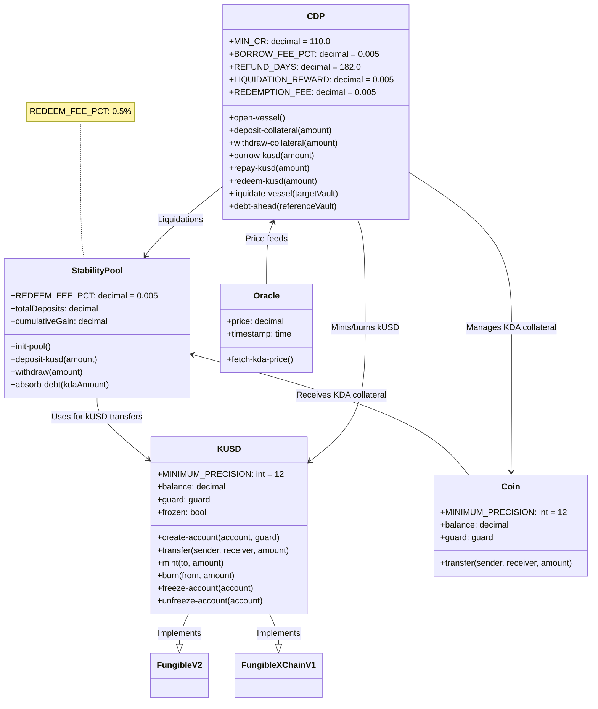
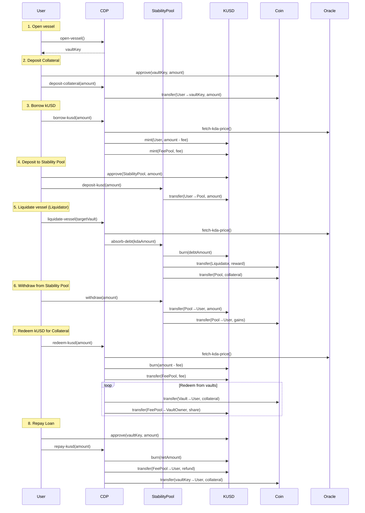
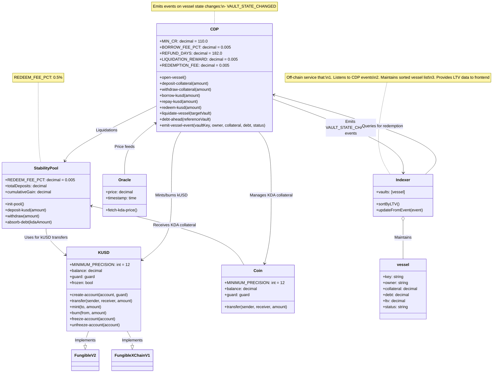
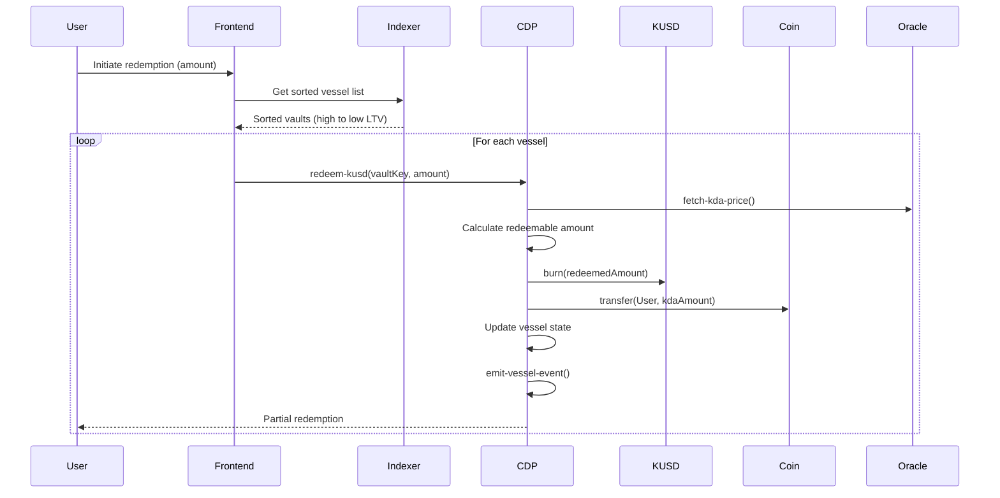

# Kudos Protocol

Kudos Protocol is a permissionless (well it still has governance for now :P), fully on-chain lending platform on Kadena that lets users lock up KDA as collateral to mint the dollar-pegged stablecoin kUSD, repay loans with time-based fee refunds, and optionally earn KDA yield via a Stability Pool.

## Concepts:

## Simplification of concepts (Business logic)

- **CDP (Collateralized Debt Position)**: Think of it as a personal borrowing account where you lock up KDA to borrow kUSD against it, with automatic safeguards to prevent under-collateralization.
- **Stability Pool**: A collective safety net funded by kUSD holders that steps in to cover bad loans, rewarding participants with KDA.
- **kUSD**: A dollar-pegged token fully backed by KDA collateral, used as the system’s medium of exchange and loan currency.

---

## CDP (Collateralized Debt Position)

A CDP is essentially your individual vault on Kadena:

1. **Lock collateral** – You deposit KDA into your own “vessel.”
2. **Borrow** – Based on how much KDA you lock and the current KDA/USD price, you can mint up to a safe percentage in kUSD (e.g. 110% collateralization).
3. **Maintain health** – If your collateral’s value drops too far (below the required buffer), anyone can liquidate your vault to protect the system.
4. **Repay & reclaim** – You pay back your kUSD plus a small fee (which can be partially refunded over time), then withdraw your KDA back.

Think of the CDP contract as kUSD’s on-chain “central bank” and risk controller in one. Whenever someone locks up KDA collateral, the CDP automatically checks that they’ve over-collateralized by a safe buffer (say 110 %), and then mints exactly that amount of kUSD into circulation nothing more, nothing less. If the borrower repays, or if a vault becomes undercollateralized and is liquidated, the CDP is the only module that can burn kUSD to retire it. All fees from borrowing or redemption flow through a dedicated “fee pool” account that CDP also manages. Every mint, burn and fee movement is transparent on chain, and governance keysets control the collateral ratios and fee parameters just like a board setting interest rates, so you always know kUSD supply is backed, audited, and adjusted under strict, programmable rules.

> **Key point:** It’s an automated, on-chain credit line secured by your own KDA, with built-in price checks and liquidation rules.

---

## Stability Pool

The Stability Pool is a communal backstop that anyone can join by depositing kUSD:

1. **Deposit kUSD** – You lock your kUSD into the pool.
2. **Absorb liquidations** – When someone’s CDP falls below the safe ratio, the pool uses its kUSD to cover that debt and in return receives the collateralized KDA.
3. **Earn yield** – Every time the pool steps in, it distributes the incoming KDA proportionally to all depositors, so you collect KDA rewards.
4. **Withdraw anytime** – You pull out your original kUSD plus any KDA you’ve earned, without needing to trigger expensive on-chain sorts or redemptions.

> **Key point:** It aligns incentives depositors share in liquidation gains, and the system has a ready source of kUSD to keep borrowing safe.

---

## kUSD Stablecoin

kUSD is the system’s dollar-pegged token, fully backed by KDA collateral in CDPs:

1. **Minting** – Created when users borrow against their CDPs (minus a small fee).
2. **Burning** – Destroyed when loans are repaid or the Stability Pool absorbs debt.
3. **One-to-one value** – Designed to trade as close to $1 as possible, enforced by the collateralization (CDP) mechanics and open liquidation.
4. **Use cases** – Acts as the on-chain “cash” for trading, lending, and liquidity provision within Kadena.

> **Key point:** kUSD gives you dollar-style stability while retaining full on-chain transparency and collateral backing.

**In short:**

**CDP**
The CDP module lets users lock KDA collateral in individual “vessels” and borrow kUSD up to a maximum Loan-to-Value ratio, enforcing collateralization via the borrow-kusd and deposit-collateral functions. If a vault’s collateral ratio falls below the protocol minimum, anyone can call liquidate-vault, which uses the Stability Pool’s kUSD to pay off debt and seizes collateral for redistribution.

**STABILITY POOL**
The Stability Pool holds users’ kUSD deposits and automatically absorbs the debt of undercollateralized CDP vaults during liquidations, exchanging pooled kUSD for KDA collateral. Depositors earn KDA yield proportional to their share of the pool each time a liquidation occurs, aligning incentives to keep the system solvent.

**Important:**

> Its important to know that, users don’t earn yield simply by opening a CDP. Any fees the CDP collects stay in the protocol’s fee pool or go back to borrowers as refunds, so to actually earn KDA you must deposit your kUSD into the Stability Pool. There, whenever under collateralized loans are liquidated, the pool uses its kUSD to cover the debt and in return distributes the incoming KDA collateral proportionally to all depositors, giving you real, on-chain yield.

# Files:

- kusd.pact (kUSD Stablecoin) borrowed from brale
- cdp.pact (Collateralized Debt Positions)
- stability-pool.pact` (Stability Pool)

--

## Meet Emily

Emily is a Kadena user who wants to borrow kUSD against her KDA.

### 1. Open a vessel

```pact
(free.cdp.open-vessel)
```

> **Success** ⇒ returns `"vessel-k:Emily"`.

**Edge**

- Calling again ⇒ `Error: "vessel already exists"`.

---

### 2. Deposit Collateral

```pact
(free.cdp.deposit-collateral 100.0)
```

> **Success** ⇒ vessel status becomes `"Active"`.

**Edges**

- Zero/negative ⇒ `Error: "Deposit amount must be > 0"`
- On closed vessel ⇒ `Error: "Vessel is closed"`

---

### 3. Borrow kUSD

```pact
(free.cdp.borrow-kusd 50.0)
```

> **Success**
>
> - Emily mints 50 kUSD to herself
> - 0.25 kUSD fee -> fee-pool
> - vessel debt = 50.25 kUSD

**Edge**

- Too much ⇒ `Error: "Collateral ratio too low"`

---

### 4. (Optional) Check Your Spot in the Redemption Queue

Before burning any kUSD, Emily can see how much debt sits ahead of her vessel (higher-LTV) with:

```pact
(free.cdp.debt-ahead "vessel-k:Emily")
```

> **Success** ⇒ e.g. `1200.0` (kUSD ahead to clear before hers).

**Edges**

- Invalid vessel key ⇒ `Error: "No value found in table free.cdp.vessels for key: vessel-k:Emily"`

---

## 5. Two Redemption Paths

### A) **Direct** (`redeem-kusd`)

1. Call

   ```pact
   (free.cdp.redeem-kusd 10.0)
   ```

2. Burns 9.95 kUSD net, fee -> fee-pool, scans **all** vaults by LTV, repays debt and returns KDA.

**Edges**

- < 1 kUSD ⇒ `Error: "Redemption amount must be >= 1 kUSD"`
- Not enough collateral ⇒ `Error: "Not enough collateral to redeem"`
- Gas-heavy at scale

---

### B) **Via the Stability Pool**

#### B.1 Deposit into Pool

```pact
(free.stability-pool.deposit-kusd 20.0)
```

> Locks 20 kUSD into the pool.

**Edges**

- ≤ 0 ⇒ `Error: "Deposit amount must be > 0"`

---

#### B.2 Someone Else’s vessel Is Liquidated

Protocol calls:

```pact
(free.stability-pool.absorb-debt <KDA-paid>)
```

> Pool’s `cumulativeGain` bumps so Emily accrues KDA yield.

---

#### B.3 **Own vessel Gets Liquidated While in Pool**

1. Emily deposits **all** 50 kUSD:

   ```pact
   (free.stability-pool.deposit-kusd 50.0)
   ```

2. Her vessel CR < 110% ⇒

   ```pact
   (free.cdp.liquidate-vessel "vessel-k:Emily")
   ```

3. Under the hood:

   - Burns 50 kUSD from the pool (covers her debt)
   - Pays liquidator 0.5 KDA
   - Sends 99.5 KDA into pool via `(free.stability-pool.absorb-debt 99.5)`
   - Bumps `cumulativeGain` so **all** depositors (just Emily) earn 99.5 KDA

4. **Outcome**

   - Her 50 kUSD is spent
   - She now holds 99.5 KDA as pool yield

---

#### B.4 Withdraw Your KDA + Yield

```pact
(free.stability-pool.withdraw 50.0)
```

> Emily receives 99.5 KDA.

**Edges**

- ≤ 0 ⇒ `Error: "Withdraw amount must be > 0"`
- > deposit ⇒ `Error: "Exceeds deposit"`

---

#### B.5 (Optional) Finish Direct Redeem

If she still held kUSD, she could:

```pact
(free.cdp.redeem-kusd remainingAmount)
```

---

### 6. Repay & Close vessel

#### 6.1 Repay

```pact
(free.cdp.repay-kusd 50.25)
```

> Burns net kUSD, refunds time-based fee; debt -> 0, status -> `"Inactive"`.

**Edges**

- Inactive vessel ⇒ `Error: "Vessel must be Active"`

#### 6.2 Withdraw Collateral

```pact
(free.cdp.withdraw-collateral 100.0)
```

> Returns her 100 KDA, vessel removed.

**Edges**

- ≤ 0 ⇒ `Error: "Withdraw amount must be > 0"`
- Ratio too low (debt remains) ⇒ `Error: "Collateral ratio too low"`

---

## 7. Liquidation Fallback

If Emily hadn’t used the pool and fell under-collateralized:

```pact
(free.cdp.liquidate-vessel "vessel-k:Emily")
```

> Burns pool kUSD, pays liquidator, traps collateral in pool.

**Edges**

- CR too healthy ⇒ `Error: "Not eligible for liquidation"`
- Pool empty ⇒ `Error: "Insufficient pool kUSD"`

A Classdiagram showcasing the protocol



---

System flow chart:
This flows cover the complete lifecycle from vessel creation to liquidation, including both CDP operations and Stability Pool interactions, with all fee mechanics and collateral movements represented.



Key User Flows Explained:

1. **vessel Creation**:

   - User opens a new collateral vessel
   - Receives unique vessel key

2. **Collateral Deposit**:

   - User approves and transfers KDA to vessel
   - Collateral amount recorded in CDP

3. **kUSD Borrowing**:

   - CDP checks collateral ratio using oracle price
   - Mints new kUSD (minus 0.5% fee)
   - Fee sent to protocol fee pool

4. **Stability Pool Deposit**:

   - User deposits kUSD into Stability Pool
   - Pool records user's share and current gain snapshot

5. **vessel Liquidation**:

   - Liquidator triggers liquidation of undercollateralized vessel
   - Stability Pool absorbs debt by burning kUSD
   - Liquidator receives 0.5% KDA reward
   - Remaining collateral goes to Stability Pool

6. **Stability Pool Withdrawal**:

   - User withdraws kUSD principal + proportional KDA gains
   - Pool updates cumulative gain tracking

7. **kUSD Redemption**:

   - User redeems kUSD for discounted collateral
   - System finds highest-LTV vaults to redeem against
   - vessel owners receive 70% of redemption fees

     **Concept of redemption better explained since this is key to the protocol**

   ## When to `redeem-kusd` vs. `repay-kusd`

   | Action            | Use Case                                 | Fee     | Effect on _your_ vault                           |
   | ----------------- | ---------------------------------------- | ------- | ------------------------------------------------ |
   | **`repay-kusd`**  | You want to clear _your_ debt            | **0 %** | Immediate debt reduction -> collateral returned  |
   | **`redeem-kusd`** | You hold _extra_ kUSD and seek arbitrage | 0.5 %   | Burns kUSD -> processes vaults in descending LTV |

   - **Always** use **`repay-kusd`** to pay down _your own_ vault: it’s the cheapest (0 % fee) and simplest path.
   - Use **`redeem-kusd`** only if you already have kUSD in wallet and want to arbitrage others’ vaults (capturing the 0.5 % discount on KDA).
     Your own vault stays out of the “front-LTV queue” as long as its LTV is lower than theirs.

   Redemption Scenarios

   ### Scenario A – Pure Redeemer (No Own Debt)

   Amir buys 102.04 kUSD for $100, meaning that 1 kUSD costs approximately $0.98 (because 100/102.04 ≈ 0.98). (arbitrage opportunity)
   This discount is the incentive for Amir to perform the arbitrage: he can redeem 102.04 kUSD for 101.53 KDA (which is worth $101.53 at 1:1 ratio) and make a profit.

   Amir holds **no debt**, just kUSD. He buys kUSD on the open market at a discount and redeems against others:

   ```mermaid
   sequenceDiagram
   title Scenario A: Pure Redeemer (No Own Debt)

   actor Amir
   participant Exchange
   participant CDP_Contract
   participant FeePool
   participant VaultOwners

   Amir->>Exchange: Buy 102.04 kUSD for $100
   Exchange-->>Amir: Transfer 102.04 kUSD
   Amir->>CDP_Contract: redeem-kusd(102.04)
   CDP_Contract->>CDP_Contract: Burn 101.53 kUSD
   CDP_Contract->>FeePool: Transfer 0.51 kUSD fee
   CDP_Contract->>VaultOwners: Distribute vault fees (70%)
   CDP_Contract-->>Amir: Transfer 101.53 KDA
   Amir->>Exchange: Sell 101.53 KDA
   Exchange-->>Amir: $101.53
   ```

   **Profit calc:**

   ```text
   investment    = $100
   kUSD_bought   ≈ 100 / 0.98 = 102.04 kUSD
   fee           = 102.04 × 0.005 = 0.51 kUSD
   KDA_received  = 102.04 – 0.51 = 101.53 KDA
   USD_return    = 101.53 × $1.00 = $101.53
   profit        = 101.53 – 100 = $1.53
   ```

   ***

   ### Scenario B – Healthy Vault (200 % LTV)

   You have **200 % collateral** (200 KDA vs. 100 kUSD debt). You hold kUSD outside the vault and want to arbitrage:

   ```mermaid
   sequenceDiagram
   title Scenario B: Healthy Vault Arbitrage

   actor You
   participant CDP_Contract
   participant FeePool
   participant VaultOwners

   You->>Exchange: Obtain 100 kUSD
   You->>CDP_Contract: redeem-kusd(100)
   CDP_Contract->>CDP_Contract: Burn 99.50 kUSD
   CDP_Contract->>FeePool: Transfer 0.50 kUSD fee
   CDP_Contract->>VaultOwners: Distribute vault fees
   CDP_Contract-->>You: Transfer 99.50 KDA
   You->>CDP_Contract: repay-kusd(100)
   CDP_Contract->>CDP_Contract: Burn 100 kUSD (no fee)
   CDP_Contract-->>You: Release 200 KDA collateral
   You->>Exchange: Sell net + collateral
   ```

   - **Net KDA profit:** 99.5 from redeem, plus you keep your original 200 KDA when you repay.
   - **Effective gain:** 0.5 % on the 100 kUSD you arbitraged, all while your vault stays safe.

   ***

   ### Scenario C – Marginal Vault (120 % LTV)

   You have **120 % collateral** (120 KDA vs. 100 kUSD debt). You think: “I’ll redeem my own debt.”

   ```mermaid
   sequenceDiagram
   title Scenario C: Self-Redemption at 120 % LTV

   actor You
   participant CDP_Contract

   You->>CDP_Contract: redeem-kusd(100)
   CDP_Contract->>CDP_Contract: Burn 99.50 kUSD
   CDP_Contract-->>You: Transfer 99.50 KDA
   Note right of CDP_Contract: Now vault owes 0.50 kUSD and holds 20.50 KDA
   ```

   **Vault before:** 120 KDA / 100 kUSD -> 83.3 % (actually _over_-collateralized vs. 110 % floor).
   **Vault after:** (20.50 KDA / 0.50 kUSD) -> 4100 % LTV!

   - But you’ve paid a **0.5 kUSD fee** for zero net benefit: you end up with 120 KDA back _minus_ the fee, plus a tiny 0.5 kUSD debt to repay.

   **Better:** just `repay-kusd(100)` -> 0 % fee, close the vault.

   ***

   ## 4. Decision Matrix

   | Vault LTV Zone | If you hold kUSD…              | Recommended Action | Why?                                  |
   | -------------- | ------------------------------ | ------------------ | ------------------------------------- |
   | **< 110 %**    | — (you’re undercollateralized) | —                  | Already at liquidation risk           |
   | **110–150 %**  | Want debt off your vault       | **`repay-kusd`**   | 0 % fee, single step                  |
   | **> 150 %**    | Arbitrage opportunity          | **`redeem-kusd`**  | Capture 0.5 % fee from _other_ vaults |

   ***

   **Bottom line:**

   - **Buffer your vault** at ≥ 150 % to stay clear of liquidation panic.
   - **Repay** when you’re in the danger zone (110–150 %).
   - **Redeem** when you’re safely over-collateralized and hold spare kUSD for arbitrage.

   > **Conclusion: Redemption is profit capture from weaker participants. Repayment is risk management. Healthy vaults can afford to hunt; weak vaults must defend**

8. **Loan Repayment**:
   - User repays kUSD to reduce debt
   - May receive prorated fee refund (up to 182 days)
   - Withdraws collateral after full repayment

---

**Issues**:

Within thic poc's cdp currently in order to redeem-kusd we have to iterate over all vessels in order to get the LTV, and sort them by their LTV ratio,
this will exhaust gas. So it would probably be best to offload this process to a indexer.

```lsp
; When a kUSD holder calls redeem-kusd, the contract:
;  1. Enforces the caller’s REDEEM_KUSD capability and minimum redeem amount.
;  2. Computes and collects the redemption fee into the fee-pool, then burns the remaining kUSD.
;  3. Verifies the fee-pool can cover 70% vessel payouts, then gathers all vaults sorted by highest LTV.
;  4. Iteratively pays off each vault’s debt up to the holder’s net kUSD, transfers the matching KDA back to the redeemer,
;     updates each vault’s collateral, debt, and status.
;  5. Distributes 70% of each vault’s share of the fee to that vessel owner (leaving 30% in the pool)
;     and ensures the entire kUSD amount was redeemed or reverts.

  (defun redeem-kusd:string (redeemAmount:decimal)
  @doc "Deduct fee, burn net kUSD, distribute fee, redeem KDA"
  (let ((callerAccount (read-msg 'sender)))
    (with-capability (REDEEM_KUSD callerAccount redeemAmount); some cap from the kusd-usd
      (enforce (>= redeemAmount 1.0) "Redemption amount must be >= 1 kUSD")

      (let* (
             ; Fetch current KDA price for valuation -spec: use oracle price
             (currentKdaPrice             (fetch-kda-price))
             ; Lookup redemption fee pct (e.g. 0.5%) - spec: fixed redemption fee
             (configuredRedemptionFeePct  (get-config "REDEEM_FEE" DEFAULT_REDEMPTION_FEE_PERCENTAGE))
             ; Compute total fee to collect -  spec: fee = redeemAmount * feePct
             (totalFeeCollected           (* redeemAmount configuredRedemptionFeePct))
             ; Net kUSD to burn after fee - spec: netRedeemable = redeemAmount - fee
             (netRedeemableAmount         (- redeemAmount totalFeeCollected))
             ; Vault-share of fee (70% of totalFeeCollected) - spec: 70% of fee to vaults
             (vaultsFeeShareTotal         (* totalFeeCollected 0.7)))

        ; we cant just call this i know
        (free.kusd-usd.burn callerAccount netRedeemableAmount)

        ; Transfer full fee into fee-pool account - collect full redemption fee
        ; first add the 100% to the fee later, 70% will be distributed to vaults
        (free.kusd-usd.transfer callerAccount (fee-pool-account) totalFeeCollected)

        ; Ensure fee-pool has enough to cover vault shares - spec: enforce sufficient fee reserve
        (let ((feePoolBalance (free.kusd-usd.get-balance (fee-pool-account))))
          (enforce (>= feePoolBalance vaultsFeeShareTotal) "Insufficient fee reserve"))

        ; Gather all vault entries with computed LTV - spec: sort vessels by descending LTV
        ; this will take up way to much gas, any other way to do this?

        ; we get all vessels, and sort them by their LTV ratio
        (let* ((allVesselEntries
                 (map (lambda (vaultOwnerKey:string)
                        (with-read vessels vaultOwnerKey
                          { "collateralAmount" := vesselCollateral
                          , "debtAmount"       := vesselDebt
                          , "status"           := vesselStatus }
                          ;; compute each vault’s loan-to-value ratio
                          (let ((loanToValueRatio
                                 (if (or (= vesselCollateral 0.0) (= vesselDebt 0.0))
                                     0.0
                                     (* 100.0 (/ vesselDebt (* vesselCollateral currentKdaPrice))))))
                            { "vaultOwner":       vaultOwnerKey
                            , "collateralAmount": vesselCollateral
                            , "debtAmount":       vesselDebt
                            , "status":           vesselStatus
                            , "loanToValueRatio": loanToValueRatio })))
                      (keys vessels)))
               (sortedVesselEntries
                 (sort allVesselEntries
                       (lambda (firstEntry secondEntry)
                         (> (at 'loanToValueRatio firstEntry)
                            (at 'loanToValueRatio secondEntry)))))

               (initialAccumulatorMap
                 { "remainingRedeem":    netRedeemableAmount ; how much kUSD we still have to spend
                 , "totalKdaRedeemed":  0.0 }) ; how much KDA we redeemed so far starting at 0

               ;;Fold over sorted vaults, redeeming up to your kUSD
               (finalAccumulatorMap
                 (fold (lambda (accumulatorMap currentVesselEntry)
                         (let* ((remainingRedeemAmount (at 'remainingRedeem accumulatorMap))
                                (entryCollateral        (at 'collateralAmount   currentVesselEntry))
                                (entryDebt              (at 'debtAmount         currentVesselEntry))
                                (entryAvailableValue    (* entryCollateral currentKdaPrice))
                                ;; max kUSD value applied to this vault’s debt
                                (redeemValueForThisVault (min remainingRedeemAmount entryDebt entryAvailableValue))
                                ;; KDA to return to the user
                                (kdaToReturnToUser      (min entryCollateral (/ redeemValueForThisVault currentKdaPrice)))
                                ;; vault’s share of the fee
                                (vaultFeeShare          (* vaultsFeeShareTotal (/ redeemValueForThisVault redeemAmount)))
                                (updatedDebtRemaining   (max 0.0 (- entryDebt redeemValueForThisVault)))
                                 (updatedVesselStatus (cond
                                    ((= updatedDebtRemaining 0.0) "Redeemed")
                                    ((< updatedDebtRemaining entryDebt) "PartiallyRedeemed")
                                    (at "status" currentVesselEntry))))

                           ; never redeem more debt or collateral than available
                           (enforce (<= redeemValueForThisVault entryDebt) "Cannot redeem more than debt")
                           (enforce (<= kdaToReturnToUser entryCollateral) "Collateral overdraw")

                           (update vessels (at 'vaultOwner currentVesselEntry)
                             { "collateralAmount": (- entryCollateral kdaToReturnToUser)
                             , "debtAmount":       updatedDebtRemaining
                             , "status":           updatedVesselStatus })

                           ; Distribute vault’s fee share - spec: pay vaults 70% of fees
                           (free.kusd-usd.transfer (fee-pool-account)
                                                   (at 'vaultOwner currentVesselEntry)
                                                   vaultFeeShare)

                           ;Accumulate remaining and redeemed totals
                           { "remainingRedeem":   (- remainingRedeemAmount redeemValueForThisVault)
                           , "totalKdaRedeemed": (+ (at 'totalKdaRedeemed accumulatorMap) kdaToReturnToUser) }))
                       initialAccumulatorMap
                       sortedVesselEntries)))

          ; Ensure we used up all your kUSD - spec: enforce full redemption or fail
          (enforce (<= (at 'remainingRedeem finalAccumulatorMap) 0.0) "Not enough collateral to redeem")

          "RedeemCompleted")))))
```

We would have something like this (pseudo)



In our pact we would do something like this:

```lsp
(defcap VAULT_STATE_CHANGED
  (vaultKey:string
   owner:string
   collateral:decimal
   debt:decimal
   status:string
  )
  @event
  true
)

; helper
(defun emit-vessel-event (vaultKey owner collateral debt status)
  (emit-event (VAULT_STATE_CHANGED vaultKey owner collateral debt status))
```

and in our primary functions we would do something like:

```lsp
(defun deposit-collateral:string (depositAmount:decimal)
  ... etc
  (update vessels callerAccount { "collateralAmount": newCollateralAmount })
  (emit-vessel-event vaultKey callerAccount newCollateralAmount currentDebtAmount currentVesselStatus)
  "DepositCompleted")
```

Our flow would become:



This way the cdp would handle single vaults instead of going over all vaults

```lsp
(defun redeem-kusd(vaultKey:string redeemAmount:decimal)
        @doc "Redeem specific amount from a single vessel"
        (let* (
              ; Fetch the up-to-date KDA/USD price from the oracle
              (currentPrice (fetch-kda-price))

              ; Load the vault record by its key
              (vessel (read vessels vaultKey))

              ;Compute the maximum kUSD you can redeem from this vault:
              ; You cannot exceed the vault’s outstanding debt
              ; You cannot extract more value than its collateral is worth
              (maxRedeemable
                (min
                  ; outstanding debt in kUSD
                  (at 'debtAmount vessel)
                  ; collateral value in kUSD = collateralAmount * price
                  (* (at 'collateralAmount vessel) currentPrice)))

              ;Determine how much to actually redeem:
              ; the lesser of what the user asked and the vault’s maxRedeemable
              (amountToRedeem (min redeemAmount maxRedeemable))

              ; Convert that kUSD amount into KDA to send back
              (kdaToSend (/ amountToRedeem currentPrice)))

          (enforce (> amountToRedeem 0)
                  "Nothing to redeem from this vessel")

          ;Update the vault’s on-chain state:
          ; - Subtract the redeemed KDA from its collateral
          ; - Subtract the redeemed kUSD from its debt
          (update vessels vaultKey {
            "collateralAmount": (- (at 'collateralAmount vessel) kdaToSend)
            , "debtAmount":       (- (at 'debtAmount vessel) amountToRedeem)
          })

          ;Burn the kUSD from the vault’s kUSD balance / (this wont work) <-- see code we need the pact gods
          (free.kusd-usd.burn
            (get-vault-principal vaultKey)
            amountToRedeem)

          ;Transfer the corresponding KDA back to the user
          (coin.transfer
            (fee-pool-account)
            (read-msg 'sender)
            kdaToSend)

          ; Improrant: We emit the event so off-chain indexers/frontends see the new vault state
          (emit-vessel-event
            vaultKey
            (at 'owner vessel)
            ; new collateral left
            (- (at 'collateralAmount vessel) kdaToSend)
            ; new debt left
            (- (at 'debtAmount vessel) amountToRedeem)
            ; status = "Redeemed" if fully cleared, else remain "Active"
            (if (= (- (at 'debtAmount vessel) amountToRedeem) 0.0)
                "Redeemed" "Active"))

          (format "Redeemed {} kUSD from vessel {}"
                  [amountToRedeem vaultKey])
      ))

```

# Protocol Example & Glossary

For reference here is an extensive glossary of all core Kudos Protocol concepts, each with clear definitions and numeric examples.

---

## Vault Health Metrics Example

| Step                       | KDA Price | Collateral Value         | Debt (kUSD) | LTV              | CR (1/LTV)      | Risk Exposure          |
| -------------------------- | --------- | ------------------------ | ----------- | ---------------- | --------------- | ---------------------- |
| **1. Healthy**             | \$1.50    | 100 × \$1.50 = \$150 USD | 100 kUSD    | 100/150 = 66.7 % | 150/100 = 150 % | 100×(1−1/1.5)=0 kUSD   |
| **2. Borderline**          | \$1.10    | 100 × \$1.10 = \$110 USD | 100 kUSD    | 100/110 = 90.9 % | 110/100 = 110 % | 100×(1−1/1.1)=9.1 kUSD |
| **3. Undercollateralized** | \$0.80    | 100 × \$0.80 = \$80 USD  | 100 kUSD    | 100/80 = 125 %   | 80/100 = 80 %   | 100×(1−0.8)=20 kUSD    |

1. **Healthy (150 % CR / 66.7 % LTV)**
   No Risk Exposure—vault is safe.

2. **Borderline (110 % CR / 90.9 % LTV)**
   $9.10 kUSD of debt isn’t fully covered.

3. **Undercollateralized (80 % CR / 125 % LTV)**
   $20 kUSD shortfall liquidators will cover this and seize that portion of collateral.

---

# Glossary

### 1. Collateral (KDA)

**Definition:**
Tokens locked into your vault to secure your kUSD loan.

**Example:**
You deposit **100 KDA**. At $1.25 KDA, your collateral value is **100 × 1.25 = $125 USD**.

---

### 2. Borrow (kUSD)

**Definition:**
Minting kUSD against your locked collateral up to a safe Loan-to-Value.

**Example:**
With $125 collateral and 110 % min-CR, max borrow = $125/1.10 = **113.64 kUSD**.

---

### 3. Mint (kUSD)

**Definition:**
Creation of new kUSD tokens when you borrow from your vault. A small borrow-fee is minted to the fee pool.

**Example:**
Borrow 100 kUSD -> you receive 100 kUSD, fee = 100×0.5% = 0.5 kUSD minted to fee-pool.

---

### 4. Loan-to-Value (LTV)

**Definition:**
Debt divided by collateral value, shows leverage.

```math
LTV = \frac{\text{Debt (kUSD)}}{\text{Collateral Value (USD)}} \times 100\%
```

**Example:**
100 kUSD debt vs \$150 collateral -> 100/150 = **66.7 % LTV**.

---

### 5. Collateral Ratio (CR)

**Definition:**
Inverse of LTV: collateral value over debt.

```math
CR = \frac{\text{Collateral Value (USD)}}{\text{Debt (kUSD)}} \times 100\%
```

**Example:**
\$110 collateral vs 100 kUSD -> 110/100 = **110 % CR**.

---

### 6. Risk Exposure

**Definition:**
Absolute unbacked debt if liquidated now.

```math
RiskExposure = \text{Debt} \times (1 - \tfrac{1}{CR})
              = \text{Debt} \times (1 - \tfrac{\text{Debt}}{\text{CollateralValue}})
```

**Example:**
Debt 100 kUSD, CR 92 % -> 100×(1−0.92)=**8 kUSD** exposure.

---

### 7. Severity (for Liquidation Reward)

**Definition:**
How far below min-CR a vault is, on \[0, 1] scale.

```math
severity = \max\bigl(0,\frac{\text{minCR} - \text{currentCR}}{\text{minCR}}\bigr)
```

**Example:**
minCR=110 %, currentCR=92 % -> severity=(1.10−0.92)/1.10≈**0.1636**.

---

### 8. Liquidation-Reward (Dynamic)

**Definition:**
Percent of collateral paid to liquidator: 0.5 % base + severity×1.5 %.

```pact
(defun liquidation-reward (currentCR minCR)
  (let ((sev (max 0.0 (/ (- minCR currentCR) minCR))))
    (+ 0.005 (* sev 0.015))))
```

**Example (92 % CR):**
0.005 + 0.1636×0.015 ≈ 0.00745 -> **0.745 %** reward.

---

### 9. Liquidate-Vault

**Definition:**
Anyone can trigger if CR\<minCR.

- Burns pool’s kUSD to clear debt.
- Pays liquidator their dynamic reward in KDA.
- Sends remaining collateral to Stability Pool.

---

### 10. Stability Pool

**Definition:**
Holds pooled kUSD from depositors.

- On liquidation, burns kUSD to clear vault debt.
- Distributes incoming collateral (minus liquidator reward) proportionally to depositors as yield.

---

### 11. Redeem-kUSD

**Definition:**
Holder burns kUSD to claim collateral from highest-LTV vaults at a small fee discount.

- Fee 0.5 % goes to fee-pool/vaults.
- Reduces system debt by burning kUSD.

---

### 12. Repay-kUSD

**Definition:**
Vault-owner burns kUSD to reduce their own debt, with pro-rata fee refunds.

- No redemption fee.
- Closes vault when debt hits zero.

---

### 13. Mint vs. Burn

- **Mint:** Creates kUSD (on borrow).
- **Burn:** Destroys kUSD (on repay, redeem, or liquidation).

---

### 14. Peg Protection

**Definition:**
Burning kUSD in liquidations and redemptions reduces supply, helping maintain \$1 peg.

---

### 15. CDP (Collateralized Debt Position)

**Definition:**
Your on-chain vault that tracks collateral, debt, and health.

---

## How They All Tie Together

- **Open CDP** -> deposit **collateral** -> **borrow**/**mint** kUSD.
- **Maintain** LTV≥min, or face **liquidation**: liquidator earns dynamic reward, rest goes to Stability Pool.
- **Stability Pool** absorbs debt by **burning** its kUSD, depositors earn KDA yield.
- **Repay** to close vault;
- **Redeem** to arbitrage other vaults and burn kUSD.
- All flows adjust **Risk Exposure**, **peg**, and keep system safe.
